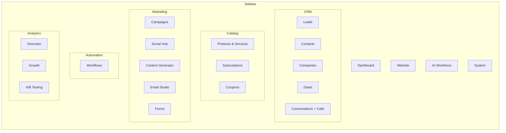

# SalesVelocity.ai — Navigation Architecture Audit

**Audit date:** 2026-04-28
**Branch:** dev
**Mode:** Single-tenant Penthouse (multi-tenant flip targeted week of May 4-10, 2026)
**Total dashboard pages:** 168 `page.tsx` files under `src/app/(dashboard)/**`
**Reference commit:** `7a030c1e` (Mar 2, 2026 — "restructure dashboard navigation from 44 to 26 sidebar items")

> **Methodology** — Static read of `AdminSidebar.tsx`, `subpage-nav.ts`, every `layout.tsx` and every hub `page.tsx`, plus a grep of all `SubpageNav` imports across `src/app/(dashboard)/**`. No runtime probing; no Next.js compile run.

---

## Section 2 — Recommendation Framework

The post-March 2 architecture is a **two-layer hub model**. Holding to it strictly resolves most placement questions:

**Layer 1 — Sidebar (the "things I do" surface).**
Every sidebar item is a *hub* I open daily. A hub is a single landing page that absorbs related sub-pages as `SubpageNav` tabs. A page belongs in the sidebar if and only if (a) the operator opens it ≥ weekly, AND (b) it represents a distinct work mode (CRM vs. Marketing vs. Website). Nine current sidebar items (Calls, Forms, Workflows, Campaigns, Conversations, Companies, Contacts, Subscriptions, Coupons, A/B Testing) are *standalone* — not hubs. That's fine for now: a standalone item is acceptable when it has no natural sub-pages, but it should be re-evaluated whenever a sibling page appears.

**Layer 2 — `/settings` (the "things I configure" surface).**
A page belongs in `/settings` if it's edited monthly or less, or if it sets policy that other pages consume. Org profile, API keys, brand kit, theme, billing, integrations, webhooks — all settings. The two-layer rule: if a page is *both* a daily-use surface and a configuration surface, the daily-use shape goes in the sidebar with a settings shortcut, not the reverse.

**Hub-tab vs. own sidebar item.**
Tabs win when the sub-pages are *modes* of the same job (e.g. Email Writer → Templates / Nurture / Builder are all "compose email"). Separate sidebar items win when the jobs are different verbs (Leads = "find people," Deals = "close people"). When you can't decide, ask: *would the user expect to switch between them with one click in the same workflow?* If yes, tabs.

**Role and feature-module gating.**
Sidebar items are already gated by `requiredPermission` + `featureModuleId` + `allowedRoles`. Hub-tabs inherit the parent hub's gate — they should not introduce *additional* gates that surprise users (a tab visible in the nav but 403-ing on click is worse than a hidden tab). The April 28 fix that ungated Content Generator from `video_production` is exactly the right pattern: "core to the platform" beats "configurable feature."

**Frequency × cognitive load drives placement.**
The sidebar should fit in one screen scroll. Today it shows ~8 sections × 1-8 items = 26 items at owner level. That's near the upper limit. Adding anything new requires removing or merging something else.

**Consolidation principle.**
Two pages should merge when they (a) share a primary data source, (b) share an audience, AND (c) the user is already context-switching between them in the same task. Merging a *list* and an *editor* is almost always right. Merging two pages that look similar but are used by different roles or in different mental models is almost always wrong (this is the trap with Campaigns vs. Workflows — see Section 3).

---

## Section 1 — Complete page inventory

> Legend:
> - **SIDEBAR** — direct sidebar item
> - **HUB-TAB** — reachable as a tab on a hub page (rendered by a `layout.tsx` or page-level `<SubpageNav>`)
> - **SETTINGS** — listed on `/settings` index
> - **REDIRECT** — file just `router.replace`s to another route
> - **ORPHAN** — no path from sidebar/settings/hub-tab gets here
> - **DEEP-LINK** — reachable only by clicking through from another page (e.g. `[id]`, `/new`, `/edit` pages)
> - **INVITE-ONLY** — onboarding/signup flow

### 1A — Top-level hub pages and their direct children

| Page route | File path | Current nav status | Recommendation |
|---|---|---|---|
| `/dashboard` | `dashboard/page.tsx` | SIDEBAR — Dashboard > Dashboard | Keep — hub root |
| `/dashboard/activities` | `dashboard/activities/page.tsx` | HUB-TAB — DASHBOARD_TABS "Activities" | Keep — but **rename** to disambiguate from `/activities` (see below). Suggest `/dashboard/recent` or fold into Dashboard root. |
| `/activities` | `activities/page.tsx` | **ORPHAN** | **Delete** OR redirect to `/dashboard/activities`. Two activity pages is a bug. |
| `/executive-briefing` | `executive-briefing/page.tsx` | HUB-TAB — DASHBOARD_TABS "Executive Briefing" | Keep |
| `/team/leaderboard` | `team/leaderboard/page.tsx` | HUB-TAB — DASHBOARD_TABS + TEAM_TABS | Keep — but Team is double-mounted under both Dashboard and (implicitly) Workforce hubs; pick one parent. |
| `/team/tasks` | `team/tasks/page.tsx` | HUB-TAB — TEAM_TABS "Tasks" | Keep |
| `/tasks` | `tasks/page.tsx` | **ORPHAN** | **Delete** OR redirect to `/team/tasks`. Three tasks pages exist (`/tasks`, `/team/tasks`, `/deals/tasks`); only the last two are reachable. |
| `/performance` | `performance/page.tsx` | HUB-TAB — TEAM_TABS "Performance" | Keep |
| `/coaching` | `coaching/page.tsx` | HUB-TAB — TEAM_TABS + COACHING_TABS | Keep |
| `/coaching/team` | `coaching/team/page.tsx` | HUB-TAB — TEAM_TABS + COACHING_TABS | Keep |
| `/playbook` | `playbook/page.tsx` | HUB-TAB — TEAM_TABS + COACHING_TABS | Keep |

### 1B — CRM hub

| Page route | File path | Current nav status | Recommendation |
|---|---|---|---|
| `/leads` | `leads/page.tsx` | SIDEBAR — CRM > Leads | **Bug:** sidebar links to `/leads` but `LEADS_TABS` first tab is `/entities/leads`. Make these consistent — either the sidebar item should point at `/entities/leads` or the tab should point at `/leads`. |
| `/entities/leads` | (via `entities/[entityName]/page.tsx`) | HUB-TAB — LEADS_TABS "All Leads" | Reconcile with `/leads` — see above. |
| `/leads/new` | `leads/new/page.tsx` | DEEP-LINK | Keep |
| `/leads/[id]` | `leads/[id]/page.tsx` | DEEP-LINK | Keep |
| `/leads/[id]/edit` | `leads/[id]/edit/page.tsx` | DEEP-LINK | Keep |
| `/leads/proposals` | `leads/proposals/page.tsx` | HUB-TAB — LEADS_TABS "Proposals / Quotes" | Keep |
| `/leads/research` | `leads/research/page.tsx` | HUB-TAB — LEADS_TABS "Intelligence Hub" | Keep |
| `/leads/discovery` | `leads/discovery/page.tsx` | REDIRECT — `/leads/research` | Keep redirect |
| `/leads/icp` | `leads/icp/page.tsx` | REDIRECT — `/leads/research` | Keep redirect |
| `/lead-scoring` | `lead-scoring/page.tsx` | HUB-TAB — LEADS_TABS "Scoring" | Keep — but consider moving under `/leads/scoring` for path coherence (cosmetic). |
| `/scraper` | `scraper/page.tsx` | REDIRECT — `/leads/research` | Keep redirect |
| `/intelligence/discovery` | `intelligence/discovery/page.tsx` | **ORPHAN** | **Delete** OR redirect to `/leads/research`. The `DiscoveryHub` component is the same family. |
| `/contacts` | `contacts/page.tsx` | SIDEBAR — CRM > Contacts | Keep |
| `/contacts/new` | `contacts/new/page.tsx` | DEEP-LINK | Keep |
| `/contacts/[id]` | `contacts/[id]/page.tsx` | DEEP-LINK | Keep |
| `/contacts/[id]/edit` | `contacts/[id]/edit/page.tsx` | DEEP-LINK | Keep |
| `/companies` | `companies/page.tsx` | SIDEBAR — CRM > Companies | Keep |
| `/deals` | `deals/page.tsx` | SIDEBAR — CRM > Deals | Keep — hub root |
| `/deals/new` | `deals/new/page.tsx` | DEEP-LINK | Keep |
| `/deals/[id]` | `deals/[id]/page.tsx` | DEEP-LINK | Keep |
| `/deals/[id]/edit` | `deals/[id]/edit/page.tsx` | DEEP-LINK | Keep |
| `/deals/orders` | `deals/orders/page.tsx` | HUB-TAB — DEALS_TABS "Orders" | Keep |
| `/deals/invoices` | `deals/invoices/page.tsx` | HUB-TAB — DEALS_TABS "Invoices" | Keep |
| `/deals/payments` | `deals/payments/page.tsx` | HUB-TAB — DEALS_TABS "Payments" | Keep |
| `/deals/tasks` | `deals/tasks/page.tsx` | HUB-TAB — DEALS_TABS "Tasks" | Keep |
| `/risk` | `risk/page.tsx` | HUB-TAB — DEALS_TABS "Risk" | Keep |
| `/living-ledger` | `living-ledger/page.tsx` | HUB-TAB — DEALS_TABS "Living Ledger" | Keep |
| `/conversations` | `conversations/page.tsx` | SIDEBAR — CRM > Conversations | Keep — but consider moving into a "Communications" hub with Calls (see Section 3). |
| `/products` | `products/page.tsx` | SIDEBAR — CRM > Products & Services + HUB-TAB | Keep — but the hub name is "Catalog" in `subpage-nav.ts` (`CATALOG_TABS`) while the sidebar label is "Products & Services". Rename one for consistency. |
| `/products/services` | `products/services/page.tsx` | HUB-TAB — CATALOG_TABS "Services" | Keep |
| `/products/new` | `products/new/page.tsx` | DEEP-LINK | Keep |
| `/products/[id]/edit` | `products/[id]/edit/page.tsx` | DEEP-LINK | Keep |
| `/orders` | `orders/page.tsx` | HUB-TAB — CATALOG_TABS "Orders" | Keep |
| `/subscriptions` | `subscriptions/page.tsx` | SIDEBAR — CRM > Subscriptions | **Duplicate:** also referenced from `CATALOG_TABS` as `/entities/subscriptions`. Pick one. Recommend keeping `/subscriptions` and updating `CATALOG_TABS`. |
| `/coupons` | `coupons/page.tsx` | SIDEBAR — CRM > Coupons + SETTINGS link + CATALOG_TABS (`/entities/coupons`) | Three references, two routes. Same fix as Subscriptions. |

### 1C — Marketing hub

| Page route | File path | Current nav status | Recommendation |
|---|---|---|---|
| `/campaigns` | `campaigns/page.tsx` | SIDEBAR — Marketing > Campaigns (standalone, no tabs) | Keep — but distinct from `/email/campaigns` (see Section 3). |
| `/social` | `social/page.tsx` | SIDEBAR — Marketing > Social Hub + HUB-TAB "Platforms" | Keep |
| `/social/campaigns` | `social/campaigns/page.tsx` | HUB-TAB — SOCIAL_TABS "Campaigns" | Keep |
| `/social/calendar` | `social/calendar/page.tsx` | HUB-TAB — SOCIAL_TABS "Calendar" | Keep |
| `/social/analytics` | `social/analytics/page.tsx` | HUB-TAB — SOCIAL_TABS "Analytics" | Keep |
| `/social/listening` | `social/listening/page.tsx` | HUB-TAB — SOCIAL_TABS "Listening" | Keep |
| `/social/agent-rules` | `social/agent-rules/page.tsx` | HUB-TAB — SOCIAL_TABS "AI Settings" | Keep |
| `/social/approvals` | `social/approvals/page.tsx` | **ORPHAN** | **Add to SOCIAL_TABS as "Approvals"** (between Calendar and Analytics). This is an active operator workflow page (DM/post approval queue). |
| `/social/platforms/[platform]` | `social/platforms/[platform]/page.tsx` | DEEP-LINK from /social | Keep |
| `/content/video` | `content/video/page.tsx` | SIDEBAR — Marketing > Content Generator | Keep |
| `/content/video/calendar` | `content/video/calendar/page.tsx` | HUB-TAB — CONTENT_GENERATOR_TABS "Calendar" | Keep |
| `/content/video/editor` | `content/video/editor/page.tsx` | HUB-TAB — "Editor" | Keep |
| `/content/video/library` | `content/video/library/page.tsx` | HUB-TAB — "Library" | Keep |
| `/content/image-generator` | `content/image-generator/page.tsx` | HUB-TAB — "Image" | Keep |
| `/content/voice-lab` | `content/voice-lab/page.tsx` | HUB-TAB — "Audio Lab" | Keep |
| `/email-writer` | `email-writer/page.tsx` | SIDEBAR — Marketing > Email Studio | Keep |
| `/marketing/email-builder` | `marketing/email-builder/page.tsx` | HUB-TAB — EMAIL_STUDIO_TABS "Email Builder" | Keep |
| `/templates` | `templates/page.tsx` | HUB-TAB — EMAIL_STUDIO_TABS "Templates" | Keep — but consider moving to `/email-writer/templates` for path coherence. |
| `/nurture` | `nurture/page.tsx` | HUB-TAB — EMAIL_STUDIO_TABS "Nurture" | Keep |
| `/nurture/new` | `nurture/new/page.tsx` | DEEP-LINK | Keep |
| `/nurture/[id]` | `nurture/[id]/page.tsx` | DEEP-LINK | Keep |
| `/nurture/[id]/stats` | `nurture/[id]/stats/page.tsx` | DEEP-LINK | Keep |
| `/email/campaigns` | `email/campaigns/page.tsx` | **ORPHAN** | **Add as EMAIL_STUDIO_TABS "Campaigns"** OR fold into `/campaigns` (see Section 3). |
| `/email/campaigns/new` | `email/campaigns/new/page.tsx` | DEEP-LINK (orphan parent) | Same fate as parent |
| `/email/campaigns/[campaignId]` | `email/campaigns/[campaignId]/page.tsx` | DEEP-LINK (orphan parent) | Same fate as parent |
| `/sequences/analytics` | `sequences/analytics/page.tsx` | HUB-TAB — ANALYTICS_TABS "Sequences" | Keep |
| `/outbound` | `outbound/page.tsx` | REDIRECT — `/email-writer` | Keep redirect |
| `/outbound/sequences` | `outbound/sequences/page.tsx` | **ORPHAN** | **Delete** — sidebar `isActive` matches the path under Email Studio but no tab links here. Functionality belongs in Nurture or Email Builder. |
| `/calls` | `calls/page.tsx` | SIDEBAR — Marketing > Calls (standalone) | Keep — but consider grouping with Conversations (see Section 3). |
| `/calls/make` | `calls/make/page.tsx` | DEEP-LINK | Keep |
| `/forms` | `forms/page.tsx` | SIDEBAR — Marketing > Forms (standalone) | Keep |
| `/forms/[formId]/edit` | `forms/[formId]/edit/page.tsx` | DEEP-LINK | Keep |
| `/workflows` | `workflows/page.tsx` | SIDEBAR — Marketing > Workflows (standalone) | Keep — but the placement under "Marketing" is wrong; workflows are general automation, not marketing. See Section 3. |
| `/workflows/new` | `workflows/new/page.tsx` | DEEP-LINK | Keep |
| `/workflows/builder` | `workflows/builder/page.tsx` | DEEP-LINK | Keep |
| `/workflows/[workflowId]` | `workflows/[workflowId]/page.tsx` | DEEP-LINK | Keep |
| `/workflows/[workflowId]/runs` | `workflows/[workflowId]/runs/page.tsx` | DEEP-LINK | Keep |
| `/proposals` | `proposals/page.tsx` | **ORPHAN** | This is the *proposal templates manager* (different from `/leads/proposals` which lists *sent* proposals). Move to `/settings` ("Proposal Templates") OR add `LEADS_TABS` "Templates" tab. PROPOSALS_TABS exists in subpage-nav.ts but is rendered nowhere. |
| `/proposals/builder` | `proposals/builder/page.tsx` | **ORPHAN** | Same fate as parent |

### 1D — Website hub

| Page route | File path | Current nav status | Recommendation |
|---|---|---|---|
| `/website/editor` | `website/editor/page.tsx` | SIDEBAR — Website > Website + HUB-TAB | Keep |
| `/website/pages` | `website/pages/page.tsx` | SIDEBAR + HUB-TAB | Keep — sidebar items duplicate hub-tabs; recommend dropping the four-item Website section in sidebar in favor of a single "Website" hub link (see Section 4). |
| `/website/templates` | `website/templates/page.tsx` | HUB-TAB — WEBSITE_TABS "Templates" | Keep |
| `/website/blog` | `website/blog/page.tsx` | SIDEBAR + HUB-TAB | Keep |
| `/website/blog/editor` | `website/blog/editor/page.tsx` | HUB-TAB — WEBSITE_BLOG_TABS "Editor" | Keep |
| `/website/blog/categories` | `website/blog/categories/page.tsx` | HUB-TAB — WEBSITE_BLOG_TABS "Categories" | Keep |
| `/website/seo` | `website/seo/page.tsx` | HUB-TAB — WEBSITE_TABS "SEO" + WEBSITE_SEO_TABS root | Keep |
| `/website/seo/competitors` | `website/seo/competitors/page.tsx` | HUB-TAB — WEBSITE_SEO_TABS | Keep |
| `/website/seo/ai-search` | `website/seo/ai-search/page.tsx` | REDIRECT — `/website/seo` | Keep redirect |
| `/website/store` | `website/store/page.tsx` | HUB-TAB — WEBSITE_TABS "Store" | Keep |
| `/website/navigation` | `website/navigation/page.tsx` | HUB-TAB — WEBSITE_TABS "Navigation" | Keep |
| `/website/settings` | `website/settings/page.tsx` | HUB-TAB — WEBSITE_TABS "Settings" | Keep |
| `/website/audit-log` | `website/audit-log/page.tsx` | HUB-TAB + SETTINGS link | Keep |
| `/website/domains` | `website/domains/page.tsx` | SIDEBAR + HUB-TAB (WEBSITE_SEO_TABS only) | **Bug:** Domains is in `WEBSITE_SEO_TABS` but NOT in `WEBSITE_TABS`. Click "Domains" in the sidebar, you land on a page where the top tab strip doesn't include "Domains". Add to `WEBSITE_TABS`. |

### 1E — AI Workforce hub

| Page route | File path | Current nav status | Recommendation |
|---|---|---|---|
| `/workforce` | `workforce/page.tsx` | SIDEBAR — AI Workforce | Keep |
| `/workforce/performance` | `workforce/performance/page.tsx` | HUB-TAB — AI_WORKFORCE_TABS "Performance" | Keep |
| `/mission-control` | `mission-control/page.tsx` | HUB-TAB — AI_WORKFORCE_TABS "Mission Control" | Keep |
| `/mission-control/history` | `mission-control/history/page.tsx` | HUB-TAB — MISSION_CONTROL_TABS "History" | Keep |
| `/mission-control/review` | `mission-control/review/page.tsx` | DEEP-LINK (querystring driven, used by Step Review widget) | Keep — but tag as deep-link, not orphan; it's intentional. |
| `/ai/datasets` | `ai/datasets/page.tsx` | HUB-TAB — AI_WORKFORCE_TABS "Models & Data" + AI_DATA_TABS "Datasets" | Keep |
| `/ai/datasets/new` | `ai/datasets/new/page.tsx` | DEEP-LINK | Keep |
| `/ai/fine-tuning` | `ai/fine-tuning/page.tsx` | HUB-TAB — AI_DATA_TABS "Fine-Tuning" | Keep |
| `/ai/fine-tuning/new` | `ai/fine-tuning/new/page.tsx` | DEEP-LINK | Keep |
| `/ai-agents` | `ai-agents/page.tsx` | REDIRECT — `/workforce` | Keep redirect |
| `/seo/training` | `seo/training/page.tsx` | TRAINING_HUB_TABS member, but **TRAINING_HUB_TABS is never imported anywhere** — page renders its own SubpageNav with a hardcoded array. Effectively reachable only via direct link from `/workforce` Training tab → `/settings/ai-agents/training`. | Move under `/workforce/training/seo` OR `/settings/ai-agents/seo-training`. Currently semi-orphan. |
| `/voice/training` | `voice/training/page.tsx` | Same as above | Same fix |

### 1F — Analytics & Growth hub

| Page route | File path | Current nav status | Recommendation |
|---|---|---|---|
| `/analytics` | `analytics/page.tsx` | SIDEBAR — Analytics > Overview + HUB-TAB | Keep |
| `/analytics/revenue` | `analytics/revenue/page.tsx` | HUB-TAB | Keep |
| `/analytics/sales` | `analytics/sales/page.tsx` | HUB-TAB "CRM Analytics" | Keep |
| `/analytics/ecommerce` | `analytics/ecommerce/page.tsx` | HUB-TAB "Sales & Orders" | Keep |
| `/analytics/attribution` | `analytics/attribution/page.tsx` | HUB-TAB | Keep |
| `/analytics/workflows` | `analytics/workflows/page.tsx` | HUB-TAB | Keep |
| `/analytics/pipeline` | `analytics/pipeline/page.tsx` | REDIRECT — `/analytics/sales` | Keep redirect |
| `/compliance-reports` | `compliance-reports/page.tsx` | HUB-TAB "Compliance" + SETTINGS link | Keep |
| `/battlecards` | `battlecards/page.tsx` | HUB-TAB "Competitor Research" | Keep |
| `/growth/command-center` | `growth/command-center/page.tsx` | SIDEBAR — Analytics > Growth | Keep |
| `/growth/competitors` | `growth/competitors/page.tsx` | HUB-TAB | Keep |
| `/growth/keywords` | `growth/keywords/page.tsx` | HUB-TAB | Keep |
| `/growth/strategy` | `growth/strategy/page.tsx` | HUB-TAB | Keep |
| `/growth/ai-visibility` | `growth/ai-visibility/page.tsx` | HUB-TAB | Keep |
| `/growth/activity` | `growth/activity/page.tsx` | HUB-TAB | Keep |
| `/ab-tests` | `ab-tests/page.tsx` | SIDEBAR — Analytics > A/B Testing (standalone) | Keep |
| `/ab-tests/new` | `ab-tests/new/page.tsx` | DEEP-LINK | Keep |
| `/ab-tests/[id]` | `ab-tests/[id]/page.tsx` | DEEP-LINK | Keep |

### 1G — System hub

| Page route | File path | Current nav status | Recommendation |
|---|---|---|---|
| `/system` | `system/page.tsx` | SIDEBAR — System | Keep |
| `/system/impersonate` | `system/impersonate/page.tsx` | HUB-TAB — SYSTEM_TABS "Impersonate" | Keep |
| `/schemas` | `schemas/page.tsx` | HUB-TAB "Schemas" + SETTINGS link | Keep |

### 1H — Settings (the second nav layer)

| Page route | File path | Current nav status | Recommendation |
|---|---|---|---|
| `/settings` | `settings/page.tsx` | SIDEBAR (footer) | Keep |
| `/settings/account` | `settings/account/page.tsx` | SETTINGS + sidebar header link | Keep |
| `/settings/organization` | `settings/organization/page.tsx` | SETTINGS — Core Configuration | Keep |
| `/settings/api-keys` | `settings/api-keys/page.tsx` | SETTINGS — Core Configuration | Keep |
| `/settings/billing` | `settings/billing/page.tsx` | SETTINGS — Core Configuration | Keep |
| `/settings/features` | `settings/features/page.tsx` | SETTINGS — Core Configuration + dedicated card | Keep |
| `/settings/meeting-scheduler` | `settings/meeting-scheduler/page.tsx` | SETTINGS — Core Configuration | Keep |
| `/settings/storefront` | `settings/storefront/page.tsx` | SETTINGS (per `storefront` module) | Keep |
| `/settings/module/[slug]` | `settings/module/[slug]/page.tsx` | SETTINGS — Feature Modules (dynamic) | Keep |
| `/settings/email-templates` | `settings/email-templates/page.tsx` | SETTINGS — Email & SMS | Keep |
| `/settings/sms-messages` | `settings/sms-messages/page.tsx` | SETTINGS — Email & SMS | Keep |
| `/settings/theme` | `settings/theme/page.tsx` | SETTINGS — Customization | Keep |
| `/settings/brand-dna` | `settings/brand-dna/page.tsx` | SETTINGS — Customization | Keep |
| `/settings/brand-kit` | `settings/brand-kit/page.tsx` | SETTINGS — Customization | Keep |
| `/settings/music-library` | `settings/music-library/page.tsx` | SETTINGS — Customization | Keep |
| `/settings/users` | `settings/users/page.tsx` | SETTINGS — Users & Access | Keep |
| `/settings/security` | `settings/security/page.tsx` | SETTINGS — Users & Access | Keep |
| `/settings/lead-routing` | `settings/lead-routing/page.tsx` | SETTINGS — Compliance & Admin | Keep |
| `/settings/automation` | `settings/automation/page.tsx` | SETTINGS — Compliance & Admin | Keep |
| `/settings/accounting` | `settings/accounting/page.tsx` | SETTINGS — Integrations | Keep |
| `/settings/integrations` | `settings/integrations/page.tsx` | SETTINGS — Integrations | Keep |
| `/settings/webhooks` | `settings/webhooks/page.tsx` | SETTINGS — Integrations | Keep |
| `/settings/custom-tools` | `settings/custom-tools/page.tsx` | SETTINGS — Integrations | Keep |
| `/settings/promotions` | `settings/promotions/page.tsx` | **ORPHAN** | **Delete** OR redirect to `/coupons`. The Promotions card on `/settings` already links to `/coupons`. |
| `/settings/subscription` | `settings/subscription/page.tsx` | **ORPHAN** | **Delete** OR redirect to `/settings/billing`. The Billing card already covers subscription management. |
| `/settings/workflows` | `settings/workflows/page.tsx` | REDIRECT — `/workflows` | Keep redirect |
| `/settings/ai-agents` | `settings/ai-agents/page.tsx` | **NOT in /settings index**, but reachable via `/workforce` sidebar `isActive` highlighting + AI_WORKFORCE_TABS "Training" | Add a card to `/settings` (e.g. under "Customization" or a new "AI Agents" section). The sub-pages (persona, voice, configuration, business-setup) are *not directly reachable* without typing the URL. |
| `/settings/ai-agents/persona` | `settings/ai-agents/persona/page.tsx` | listed in AI_AGENTS_SETTINGS_TABS but **AI_AGENTS_SETTINGS_TABS is never imported anywhere** | **Wire AI_AGENTS_SETTINGS_TABS** into a `settings/ai-agents/layout.tsx` (this is the cleanest fix — one new file, all six pages light up). |
| `/settings/ai-agents/training` | `settings/ai-agents/training/page.tsx` | HUB-TAB — AI_WORKFORCE_TABS "Training" + (would be AI_AGENTS_SETTINGS_TABS if wired) | Keep |
| `/settings/ai-agents/voice` | `settings/ai-agents/voice/page.tsx` | listed in AI_AGENTS_SETTINGS_TABS, **not wired** | Wire (see above) |
| `/settings/ai-agents/business-setup` | `settings/ai-agents/business-setup/page.tsx` | listed in AI_AGENTS_SETTINGS_TABS, **not wired** | Wire (see above) |
| `/settings/ai-agents/configuration` | `settings/ai-agents/configuration/page.tsx` | listed in AI_AGENTS_SETTINGS_TABS, **not wired** | Wire (see above) |

### 1I — Misc / footer / utility

| Page route | File path | Current nav status | Recommendation |
|---|---|---|---|
| `/academy` | `academy/page.tsx` | SIDEBAR (footer) | Keep |
| `/onboarding` | `onboarding/page.tsx` | INVITE-ONLY (signup flow) | Keep |
| `/integrations` | `integrations/page.tsx` | REDIRECT — `/settings/integrations` | Keep redirect |
| `/entities/[entityName]` | `entities/[entityName]/page.tsx` | DYNAMIC — backs `/entities/leads`, `/entities/coupons`, `/entities/subscriptions`, `/entities/email_templates` | Keep |
| `/tools/[toolId]` | `tools/[toolId]/page.tsx` | DEEP-LINK from `/settings/custom-tools` | Keep |

---

## Summary counts

- **Total pages audited:** 168
- **Sidebar-direct items (owner view):** 26 (matches the March 2 commit message)
- **Settings cards visible to owner:** 27
- **Hub-tab pages:** ~95
- **Deep-link only pages (`/new`, `/edit`, `[id]`):** 33
- **Redirects (intentional):** 9 — `/outbound`, `/integrations`, `/ai-agents`, `/settings/workflows`, `/analytics/pipeline`, `/leads/discovery`, `/leads/icp`, `/scraper`, `/website/seo/ai-search`
- **True orphans (no nav path, not redirects, not deep-link children of orphans):** **9**
  1. `/activities` — duplicate of `/dashboard/activities`
  2. `/tasks` — duplicate of `/team/tasks` and `/deals/tasks`
  3. `/intelligence/discovery` — duplicate of `/leads/research`
  4. `/social/approvals` — should be a SOCIAL_TABS tab
  5. `/email/campaigns` (+ `/new`, `/[id]`) — should be in EMAIL_STUDIO_TABS or merged into `/campaigns`
  6. `/outbound/sequences` — superseded by Nurture
  7. `/proposals` (+ `/builder`) — should be in /settings or LEADS_TABS
  8. `/settings/promotions` — duplicate of `/coupons`
  9. `/settings/subscription` — duplicate of `/settings/billing`

- **Unused tab arrays in `subpage-nav.ts`:**
  - `LEAD_INTEL_TABS` — superseded by `LEADS_TABS`, but still defined and references the orphan `/scraper` redirect
  - `PROPOSALS_TABS` — never imported
  - `TRAINING_HUB_TABS` — never imported
  - `AI_AGENTS_SETTINGS_TABS` — never imported (the bug behind orphaned `/settings/ai-agents/persona|voice|business-setup|configuration`)

---

## Section 3 — Pages that should be COMBINED (or deliberately kept separate)

### 3A — Campaigns vs. Email Campaigns vs. Workflows vs. Nurture

This is the single biggest IA mess in the dashboard. Five pages, four mental models, three data sources.

| Page | What it does today | Data source | Primary actor | Audience |
|---|---|---|---|---|
| `/campaigns` | Lists *orchestrated* campaigns — multi-channel deliverable bundles (videos, emails, images, social posts) created by Jasper via `propose_mission_plan`. Status filters, deliverable progress, click-through to Mission Control. | `campaigns` collection | Operator approves; Jasper creates | Marketer / owner |
| `/email/campaigns` | Lists *email-only* campaigns — classic "send a blast to a list" with SendGrid send history, opens, clicks. Has `/new` and `/[campaignId]` editor pages. | `emailCampaigns` collection | Operator creates by hand | Marketer |
| `/email-writer` (Email Studio) | Per-email *composition* surface. Generates one email at a time with deal scoring + battlecards. Tabs: Email Writer / Nurture / Email Builder / Templates. | `generatedEmails` history per user | Operator writes (with AI assist) | Sales rep |
| `/nurture` | Multi-touch email *sequences* — the Nurture engine. List + `/new` + `/[id]` + stats. | `nurtureCampaigns` collection | Operator configures, system fires | Marketer |
| `/workflows` | General automation engine — time/event-triggered actions across any channel (email, SMS, webhooks, internal tasks). | `workflows` collection (Stage A.5 ships staggered `sequenceJobs`) | Operator configures, system fires | Power user / admin |

**Real overlap vs apparent overlap:**

- `/campaigns` and `/email/campaigns` **overlap** — both are "campaign lists." A user who wants to "see all my campaigns" doesn't know which one to open. **Verdict: merge.** Make `/campaigns` the unified campaigns list with a "Type" filter (Orchestrated / Email-only / Social-only). The `/email/campaigns/[campaignId]` editor stays as a deep-link.
- `/nurture` and `/workflows` **don't overlap** in user mind — Nurture = "multi-touch email" (email-shaped), Workflow = "if X then Y" (logic-shaped). **Verdict: keep separate** but rename Workflows to make the distinction obvious (e.g. "Automations").
- `/email-writer` (Email Studio) is the **composition** surface, not a campaign manager. **Verdict: keep separate** — it's a writing tool, not a list.
- `/workflows` placement under "Marketing" in the sidebar is wrong — workflows touch CRM, support, billing, and operations. **Verdict: move to its own sidebar slot** OR group with Forms under a new "Automation" section.

### 3B — Tasks (three pages, one concept)

`/tasks`, `/team/tasks`, `/deals/tasks` all show task lists.
- `/tasks` is the **orphan** with no nav path.
- `/team/tasks` is the team collaboration task list (`TeamTask` type — assignees, status, blocked).
- `/deals/tasks` is deal-scoped tasks (CRM activity).

These are genuinely different audiences. **Verdict: delete `/tasks`** (or redirect it to `/team/tasks`). Keep `/team/tasks` and `/deals/tasks` separate.

### 3C — Activities (two pages, one concept)

`/activities` and `/dashboard/activities` both show activity timelines. The orphan `/activities` is older. **Verdict: redirect `/activities` to `/dashboard/activities`** OR delete `/activities` entirely if no incoming links exist.

### 3D — Lead intelligence (the redirect cluster)

`/leads/discovery`, `/leads/icp`, `/scraper`, `/intelligence/discovery` — the first three are clean redirects to `/leads/research`. The fourth (`/intelligence/discovery`) is an actual page, with a different `DiscoveryHub` component. **Verdict: collapse `/intelligence/discovery` into `/leads/research` too** (either by importing the same `DiscoveryHub` or by adding a redirect).

### 3E — Conversations + Calls (suggested grouping, low priority)

`/conversations` (chat sessions) and `/calls` (voice call log) are both communication histories. They live as separate sidebar items today. A "Communications" hub with two tabs would tighten the CRM section without losing anything — but this is a polish move, not a fix.

### 3F — Subscriptions and Coupons (resolve the duplicate URL paths)

Both pages exist at two URLs:
- `/subscriptions` (sidebar) AND `/entities/subscriptions` (CATALOG_TABS)
- `/coupons` (sidebar + settings) AND `/entities/coupons` (CATALOG_TABS)

These point at different rendering paths but the same data. **Verdict: pick one URL each, redirect the other.** Recommend keeping `/subscriptions` and `/coupons` as canonical (cleaner URLs), and have `CATALOG_TABS` reference those directly.

### 3G — Proposals (templates manager vs. sent proposals)

`/proposals` = template manager (orphan). `/leads/proposals` = sent-proposal tracker. **These are different jobs and should stay separate**, but `/proposals` needs a home. Recommend moving it to `/settings` ("Proposal Templates") under the **Customization** section — it's configuration, not daily use.

---

## Section 4 — Proposed two-layer nav design

### Sidebar (Layer 1) — the daily-use surface

**Diff from today:**
- **Move** Workflows out of Marketing into its own "Automation" section (one item today, but the section header signals intent and leaves room for future siblings).
- **Merge** Calls into a Conversations hub (Tabs: Chat / Voice). Drops one sidebar item.
- **Consolidate** Website's 4 items down to 1 hub link (the four tabs are already in `WEBSITE_TABS`, the sidebar duplication is noise).
- Final count: 8 sections, ~22 items at owner level.

### Sidebar item → hub-tabs mapping (the consolidated `subpage-nav.ts`)

| Sidebar item | Hub root | Tabs |
|---|---|---|
| Dashboard | `/dashboard` | Dashboard / Activities / Executive Briefing / Team |
| Leads | `/leads` | All Leads / Proposals / Intelligence / Scoring |
| Contacts | `/contacts` | (standalone) |
| Companies | `/companies` | (standalone) |
| Deals | `/deals` | All Deals / Orders / Invoices / Payments / Tasks / Risk / Living Ledger |
| Conversations | `/conversations` | Chat / Voice |
| Products | `/products` | Products / Services / Orders |
| Subscriptions | `/subscriptions` | (standalone) |
| Coupons | `/coupons` | (standalone) |
| Campaigns | `/campaigns` | All / Orchestrated / Email / Social (filter-tabs) |
| Social Hub | `/social` | Platforms / Campaigns / Calendar / **Approvals** / Analytics / Listening / AI Settings |
| Content Generator | `/content/video` | Video / Calendar / Image / Editor / Library / Audio Lab |
| Email Studio | `/email-writer` | Writer / Nurture / Builder / Templates |
| Forms | `/forms` | (standalone) |
| Workflows | `/workflows` | (standalone) |
| Website | `/website/editor` | Editor / Pages / Templates / Blog / SEO / **Domains** / Store / Navigation / Settings / Audit Log |
| AI Workforce | `/workforce` | Agents / Mission Control / Performance / Training / Models & Data |
| Analytics Overview | `/analytics` | Overview / Revenue / CRM Analytics / Sales & Orders / Attribution / Workflows / Sequences / Compliance / Competitor Research |
| Growth | `/growth/command-center` | Command Center / Competitors / Keywords / Strategy / AI Visibility / Activity |
| A/B Testing | `/ab-tests` | (standalone) |
| System | `/system` | System Health / Impersonate / Schemas |

### `/settings` (Layer 2) — the configuration surface

```mermaid
graph TB
    S[/settings/]
    subgraph Core
        SO[Organization Profile]
        SK[API Keys]
        SB[Billing & Plans]
        SF[Feature Toggles]
        SM[Meeting Scheduler]
    end
    subgraph FeatureModules
        FM[per-module settings]
    end
    subgraph Communications
        SE[Email Templates]
        SS[SMS Messages]
    end
    subgraph Branding
        ST[CRM Theme]
        SD[Brand DNA]
        SBK[Brand Kit]
        SML[Music Library]
        PT[Proposal Templates]
    end
    subgraph AIAgents
        AAP[Agent Persona]
        AAT[Training]
        AAV[Voice]
        AAB[Business Setup]
        AAC[Configuration]
    end
    subgraph UsersAccess
        SU[Team Members]
        SSE[Security]
    end
    subgraph ComplianceAdmin
        SCR[Compliance Reports]
        SAL[Audit Log]
        SLR[Lead Routing]
        SAU[Inbound Automation]
    end
    subgraph Integrations
        SAC[Accounting]
        SI[Business Apps]
        SW[Webhooks]
        SCT[Custom Tools]
    end
    subgraph Advanced
        SCH[Schema Editor]
    end
    S --> Core --> FeatureModules --> Communications --> Branding --> AIAgents --> UsersAccess --> ComplianceAdmin --> Integrations --> Advanced
```

**Diff from today:**
- **Add** "AI Agents" section to `/settings` index — exposes Persona / Training / Voice / Business Setup / Configuration. These are currently only reachable via the AI Workforce sidebar item or by URL-typing.
- **Add** "Proposal Templates" link to Branding section pointing at `/proposals` (today an orphan).
- **Drop** "E-Commerce > Promotions & Coupons" (the link goes to `/coupons` which is already a sidebar item — duplicate).
- **Remove** orphan files: `/settings/promotions`, `/settings/subscription`.

---

## Section 5 — Implementation plan

### Phase 1 — Pure additions (zero behavior change)

These are link-only fixes. No page logic changes, low risk, can ship before YC interview.

| Change | Files touched | Risk |
|---|---|---|
| Add `/social/approvals` to `SOCIAL_TABS` | `src/lib/constants/subpage-nav.ts` | None |
| Add `/website/domains` to `WEBSITE_TABS` (currently only in WEBSITE_SEO_TABS) | `src/lib/constants/subpage-nav.ts` | None |
| Add an "AI Agents" section to `/settings` index linking to the 5 sub-pages | `src/app/(dashboard)/settings/page.tsx` | None |
| Create `src/app/(dashboard)/settings/ai-agents/layout.tsx` rendering `<SubpageNav items={AI_AGENTS_SETTINGS_TABS} />` | 1 new file | None — array already exists |
| Add "Proposal Templates" card to `/settings` Customization section linking to `/proposals` | `src/app/(dashboard)/settings/page.tsx` | None |
| **Estimated edits:** 3 files modified + 1 new file (~30 LOC) | | **Risk: very low** |

### Phase 2 — Convert orphans to redirects (low risk)

| Change | Files touched | Risk |
|---|---|---|
| `/activities/page.tsx` → redirect to `/dashboard/activities` | 1 file | Low — confirm no incoming `<Link>` references first |
| `/tasks/page.tsx` → redirect to `/team/tasks` | 1 file | Low — same caveat |
| `/intelligence/discovery/page.tsx` → redirect to `/leads/research` | 1 file | Low |
| `/outbound/sequences/page.tsx` → redirect to `/nurture` (or delete entirely) | 1 file | Medium — verify the dispatcher cron isn't pointing here |
| `/settings/promotions/page.tsx` → redirect to `/coupons` | 1 file | Low |
| `/settings/subscription/page.tsx` → redirect to `/settings/billing` | 1 file | Low |
| **Estimated edits:** 6 files (~10 LOC each) | | **Risk: low** |

### Phase 3 — Consolidations (medium risk, defer until after YC)

| Change | Files touched | Risk |
|---|---|---|
| Merge `/email/campaigns` list into `/campaigns` with a Type filter; keep `/email/campaigns/[campaignId]` editor as deep-link | `/campaigns/page.tsx` (filter UI), redirect from `/email/campaigns` | Medium — touches campaign data fetching |
| Merge `/calls` and `/conversations` into a single Conversations hub with Chat/Voice tabs | New layout, sidebar update, new `CONVERSATIONS_TABS` array | Medium — UI restructure |
| Reduce Website sidebar from 4 items to 1 hub link | `AdminSidebar.tsx` (remove 3 items, leave Editor as the hub entry) | Low — tabs already exist |
| Move Workflows out of "Marketing" into a new "Automation" section (or its own slot) | `AdminSidebar.tsx` (move one item, add section header) | Low |
| Pick canonical URL for Subscriptions / Coupons; redirect the other | 2 redirect files; `subpage-nav.ts` update | Low |
| Reconcile `/leads` vs `/entities/leads` — make sidebar and `LEADS_TABS` first tab agree | `AdminSidebar.tsx` or `subpage-nav.ts` | Low — but verify which view is the real one |
| Rename `CATALOG_TABS`'s sidebar label "Products & Services" → "Catalog" (or rename the tab array to `PRODUCTS_TABS`) for naming consistency | 1 file | None |
| **Estimated edits:** ~12 files | | **Risk: medium** |

### Phase 4 — Cleanup (defer indefinitely, do after multi-tenant flip)

| Change | Files touched | Risk |
|---|---|---|
| Delete unused `LEAD_INTEL_TABS`, `PROPOSALS_TABS`, `TRAINING_HUB_TABS`, `AI_AGENTS_SETTINGS_TABS` (or wire them — Phase 1 wires AI_AGENTS_SETTINGS_TABS, the others can be deleted) | `src/lib/constants/subpage-nav.ts` | Low |
| Decide whether `/seo/training` and `/voice/training` should live under `/workforce/training/<domain>` or `/settings/ai-agents/<domain>-training` (currently semi-orphaned with hardcoded SubpageNav arrays) | 2 page files moved or aliased | Medium — touches training pipeline UX |

---

## Pre-YC priority list (what to ship in the next 48 hours)

If only one phase ships before the YC interview, ship **Phase 1**. It's link-only, has zero behavior risk, and resolves the most visible IA bugs:

1. Wire `AI_AGENTS_SETTINGS_TABS` (one new layout file → unlocks 5 sub-pages)
2. Add "AI Agents" section to `/settings`
3. Add `/social/approvals` to `SOCIAL_TABS`
4. Add `/website/domains` to `WEBSITE_TABS`
5. Add "Proposal Templates" link in `/settings` Customization

If a Phase 2 redirect feels safe enough to do alongside, take `/intelligence/discovery → /leads/research` — that's a single `useEffect` redirect that closes a real orphan with no data-flow risk.

The Section 3A consolidation (Campaigns / Email Campaigns / Workflows / Nurture) is the most strategically important fix but the riskiest. Don't touch it before YC. Do it after the multi-tenant flip when the campaign data model is being re-examined for tenant scoping anyway.

---

*End of report.*
